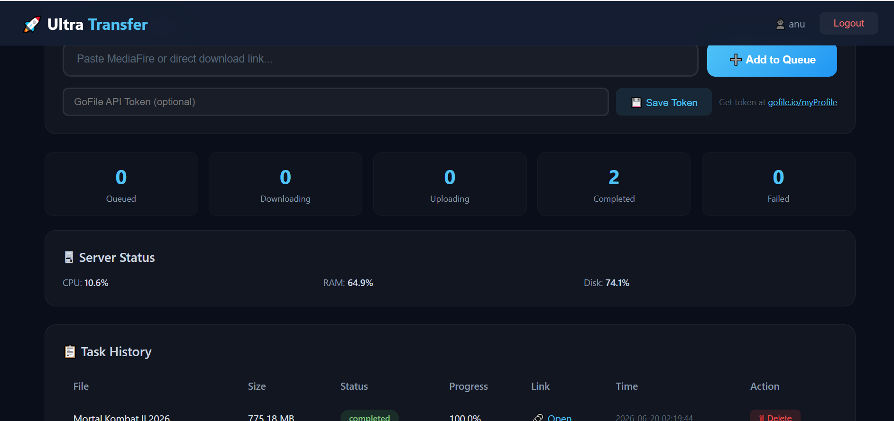
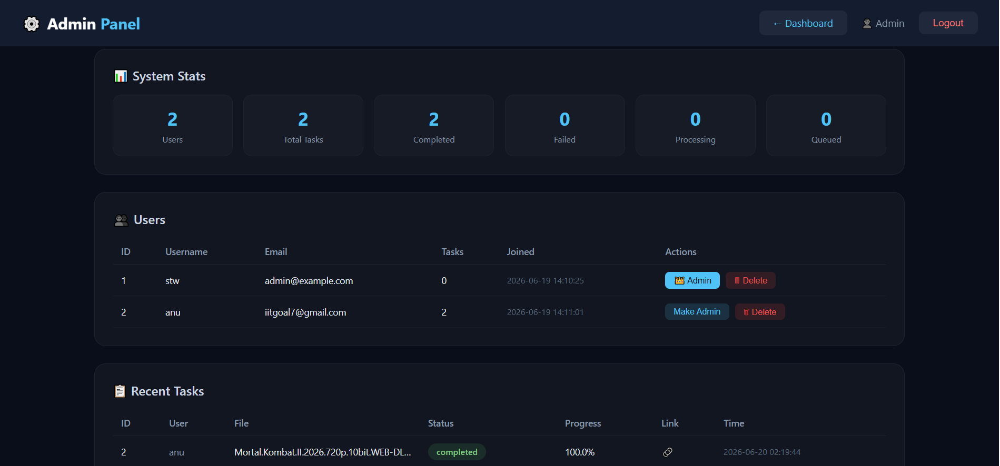

# 🚀 Ultra Transfer Web

<div align="center">


**A powerful web application to download files from MediaFire/direct links and upload them to GoFile.io with real-time progress tracking.**

[Features](#-features) • [Demo](#-demo) • [Installation](#-installation) • [Usage](#-usage) • [API](#-api) • [Screenshots](#-screenshots) • [Contributing](#-contributing)

</div>

---

## 📌 Table of Contents

- [🌟 Features](#-features)
- [🖥️ Demo](#-demo)
- [📋 Prerequisites](#-prerequisites)
- [⚙️ Installation](#-installation)
- [🚀 Usage](#-usage)
- [🔧 Configuration](#-configuration)
- [📊 API Reference](#-api-reference)
- [📸 Screenshots](#-screenshots)
- [🛠️ Technologies Used](#-technologies-used)
- [🤝 Contributing](#-contributing)
- [📄 License](#-license)
- [👨‍💻 Author](#-author)

---

## 🌟 Features

### Core Features
- ✅ **Multi-Source Downloads** - Support for MediaFire links and direct download URLs
- ✅ **GoFile.io Upload** - Automatic server selection for optimal upload speed
- ✅ **Real-time Progress** - Live tracking with speed, ETA, and percentage
- ✅ **User Authentication** - Register, Login, and Logout functionality
- ✅ **Task Queue System** - Multiple downloads processed in order
- ✅ **Admin Panel** - User management and system monitoring

### Technical Features
- 🔄 **Async Processing** - Background task processing for large files
- 📊 **Live Statistics** - CPU, RAM, Disk usage monitoring
- 🗑️ **Task Management** - Delete completed or failed tasks
- 🔐 **Secure Authentication** - Bcrypt password hashing
- 💾 **Persistent Storage** - SQLite database for users and tasks
- 📱 **Responsive Design** - Works on desktop, tablet, and mobile

---

## 🖥️ Demo

### Live Demo URL
```
http://localhost:5000
```

### Test Credentials
```
Username: stw
Password: anubhav
```

> ⚠️ **Note**: This is the default admin account. Change credentials in production.

---

## 📋 Prerequisites

Before you begin, ensure you have the following installed:

- Python 3.9 or higher
- pip (Python package manager)
- Git (optional)

---

## ⚙️ Installation

### 1. Clone the Repository

```bash
git clone https://github.com/yourusername/ultra-transfer.git
cd ultra-transfer
```

### 2. Create Virtual Environment (Optional but Recommended)

```bash
python -m venv venv
source venv/bin/activate  # On Windows: venv\Scripts\activate
```

### 3. Install Dependencies

Create `requirements.txt`:

```txt
Flask
Flask-SQLAlchemy
Flask-Bcrypt
requests
httpx
urllib3
beautifulsoup4
lxml
psutil
```

Then install:

```bash
pip install -r requirements.txt
```

### 4. Run the Application

```bash
python app_web.py
```

### 5. Access the Application

Open your browser and navigate to:
```
http://localhost:5000
```

---

## 🚀 Usage

### User Guide

#### 1. **Registration & Login**

| Action | URL | Description |
|--------|-----|-------------|
| Register | `/register` | Create a new account |
| Login | `/login` | Login to your account |
| Dashboard | `/dashboard` | Main application interface |

#### 2. **Adding a Download**

1. Copy your MediaFire or direct download link
2. Paste it in the input field
3. Click "Add to Queue"
4. Monitor progress in real-time

#### 3. **Task Management**

| Action | Description |
|--------|-------------|
| View Tasks | See all your tasks in the history table |
| Track Progress | Real-time progress bar with speed and ETA |
| Delete Tasks | Remove completed or failed tasks |
| Open Link | Click the link to open your uploaded file on GoFile.io |

#### 4. **GoFile Token Setup**

1. Go to [GoFile.io](https://gofile.io/myProfile)
2. Get your API token
3. Paste it in the token input field
4. Click "Save Token"

### Admin Guide

| Action | URL | Description |
|--------|-----|-------------|
| Admin Panel | `/admin` | Access the admin dashboard |
| User Management | Admin Panel | View, promote, or delete users |
| System Stats | Admin Panel | View system statistics |

---

## 🔧 Configuration

### Environment Variables

Create a `.env` file in the root directory:

```env
FLASK_APP=app_web.py
FLASK_ENV=production
SECRET_KEY=your-secret-key-here
DATABASE_URL=sqlite:///users.db
```

### Custom Configuration in `app_web.py`

```python
# Server Configuration
app.secret_key = 'your-secret-key-here'  # Change this!
app.config['PERMANENT_SESSION_LIFETIME'] = 86400  # 24 hours

# Download Settings
DOWNLOAD_CHUNK_SIZE = 4 * 1024 * 1024  # 4 MB
TEMP_DOWNLOAD_DIR = "temp_downloads"

# GoFile Settings
GOFILE_API_BASE = "https://api.gofile.io"
```

---

## 📊 API Reference

### Authentication Endpoints

| Method | Endpoint | Description |
|--------|----------|-------------|
| POST | `/api/register` | Register a new user |
| POST | `/api/login` | Login user |
| POST | `/api/logout` | Logout user |
| GET | `/api/user` | Get current user info |

### Task Endpoints

| Method | Endpoint | Description |
|--------|----------|-------------|
| POST | `/api/task` | Create a new download task |
| GET | `/api/tasks` | Get all user tasks |
| GET | `/api/tasks/active` | Get currently active task |
| GET | `/api/queue/status` | Get queue status |
| DELETE | `/api/task/<id>` | Delete a task |

### Admin Endpoints

| Method | Endpoint | Description |
|--------|----------|-------------|
| GET | `/api/admin/users` | Get all users |
| GET | `/api/admin/tasks` | Get all tasks |
| GET | `/api/admin/stats` | Get system statistics |
| PUT | `/api/admin/user/<id>` | Update user |
| DELETE | `/api/admin/user/<id>` | Delete user |

### System Endpoints

| Method | Endpoint | Description |
|--------|----------|-------------|
| GET | `/api/server/status` | Get server status (CPU, RAM, Disk) |
| POST | `/api/set_gofile_token` | Set GoFile API token |

---

## 📸 Screenshots

### Dashboard Page



*Figure 1: Main dashboard showing download interface, progress tracking, and task history*

### Admin Panel



*Figure 2: Admin panel with user management and system statistics*

### Login Page

```
+------------------------------------------+
|        🚀 Ultra Transfer                   |
|        Fast Download & Upload to GoFile    |
|                                            |
|    [Login Form]                            |
|    Username: [____________]                |
|    Password: [____________]                |
|                                            |
|    [Login]                                 |
|    Don't have account? Register           |
+------------------------------------------+
```

### Dashboard Layout

```
+------------------------------------------+
| 🚀 Ultra Transfer  | 👤 User | Logout    |
+------------------------------------------+
| 📥 Add Download Link                      |
| [Paste URL...] [➕ Add to Queue]         |
| [GoFile Token...] [💾 Save Token]        |
|                                           |
| 📊 Processing                            |
| File: example.mp4                        |
| ████████████████░░░░ 85%                |
| Speed: 2.5 MB/s | ETA: 30s              |
|                                           |
| 📋 Task History                          |
| +-------+--------+--------+----------+  |
| | File  | Status | Progress | Link    |  |
| +-------+--------+--------+----------+  |
| | file1 | ✓ Done | 100%    | 🔗 Open |  |
| | file2 | ⏳ Down | 45%     | —       |  |
| +-------+--------+--------+----------+  |
+------------------------------------------+
```

### Admin Panel Layout

```
+------------------------------------------+
| ⚙️ Admin Panel      | Dashboard | Logout  |
+------------------------------------------+
| 📊 System Stats                          |
| Users: 5 | Tasks: 12 | Completed: 8     |
|                                           |
| 👥 Users Management                      |
| +----+----------+----------+----------+  |
| | ID | Username | Email    | Actions  |  |
| +----+----------+----------+----------+  |
| | 1  | stw      | admin..  | 👑🔄🗑  |  |
| | 2  | john     | john..   | 🔄🗑    |  |
| +----+----------+----------+----------+  |
+------------------------------------------+
```

---

## 🛠️ Technologies Used

### Backend
- **[Flask](https://flask.palletsprojects.com/)** - Web framework
- **[SQLAlchemy](https://www.sqlalchemy.org/)** - ORM for database
- **[Flask-Bcrypt](https://flask-bcrypt.readthedocs.io/)** - Password hashing
- **[SQLite](https://www.sqlite.org/)** - Database

### HTTP & Networking
- **[Requests](https://docs.python-requests.org/)** - HTTP client
- **[httpx](https://www.python-httpx.org/)** - Async HTTP client
- **[BeautifulSoup4](https://www.crummy.com/software/BeautifulSoup/)** - HTML parsing
- **[lxml](https://lxml.de/)** - XML/HTML parser

### System Monitoring
- **[psutil](https://psutil.readthedocs.io/)** - System monitoring

### Frontend
- **HTML5** - Structure
- **CSS3** - Styling with custom properties
- **JavaScript** - Interactive features

---

## 📁 Project Structure

```
ultra-transfer/
├── app_web.py              # Main application file
├── requirements.txt        # Python dependencies
├── users.db               # SQLite database (auto-created)
├── temp_downloads/        # Temporary download directory
├── img1.png               # Dashboard screenshot
├── img2.png               # Admin panel screenshot
├── templates/
│   ├── login.html         # Login page
│   ├── register.html      # Registration page
│   ├── dashboard.html     # User dashboard
│   └── admin.html         # Admin panel
└── README.md              # This file
```

---

## 🤝 Contributing

Contributions are welcome! Here's how you can help:

### 🐛 Report Bugs
- Use the issue tracker to report bugs
- Include detailed steps to reproduce
- Mention your environment (OS, Python version)

### 💡 Suggest Features
- Open an issue with your feature suggestion
- Explain the use case and benefits
- Provide examples if possible

### 🔧 Submit Pull Requests

1. Fork the repository
2. Create a feature branch:
```bash
git checkout -b feature/amazing-feature
```
3. Commit your changes:
```bash
git commit -m 'Add amazing feature'
```
4. Push to the branch:
```bash
git push origin feature/amazing-feature
```
5. Open a Pull Request

### 📝 Coding Standards
- Follow PEP 8 guidelines
- Add comments for complex logic
- Update documentation accordingly

---

## 🐛 Common Issues & Solutions

### Issue: "Network error" on login
**Solution**: Ensure the server is running and check your firewall settings.

### Issue: Upload fails after download
**Solution**: Check your GoFile API token and internet connectivity.

### Issue: Dashboard is blank
**Solution**: Clear browser cache and restart the server.

### Issue: File shows "Resolving..."
**Solution**: This is resolved in the latest version. Update your code.

---

## 📄 License

This project is licensed under the MIT License - see the [LICENSE](LICENSE) file for details.

```
MIT License

Copyright (c) 2026 Ultra Transfer

Permission is hereby granted, free of charge, to any person obtaining a copy
of this software and associated documentation files (the "Software"), to deal
in the Software without restriction, including without limitation the rights
to use, copy, modify, merge, publish, distribute, sublicense, and/or sell
copies of the Software, and to permit persons to whom the Software is
furnished to do so, subject to the following conditions:

The above copyright notice and this permission notice shall be included in all
copies or substantial portions of the Software.

THE SOFTWARE IS PROVIDED "AS IS", WITHOUT WARRANTY OF ANY KIND, EXPRESS OR
IMPLIED, INCLUDING BUT NOT LIMITED TO THE WARRANTIES OF MERCHANTABILITY,
FITNESS FOR A PARTICULAR PURPOSE AND NONINFRINGEMENT. IN NO EVENT SHALL THE
AUTHORS OR COPYRIGHT HOLDERS BE LIABLE FOR ANY CLAIM, DAMAGES OR OTHER
LIABILITY, WHETHER IN AN ACTION OF CONTRACT, TORT OR OTHERWISE, ARISING FROM,
OUT OF OR IN CONNECTION WITH THE SOFTWARE OR THE USE OR OTHER DEALINGS IN THE
SOFTWARE.
```

---

## 👨‍💻 Author

<div align="center">
  
### Made with ❤️ by Anubhav

[](https://github.com/anubhav)
[](mailto:contact@example.com)

</div>

---

## 🌟 Support

If you find this project useful, please consider:
- ⭐ Starring the repository
- 🐛 Reporting issues
- 💡 Suggesting features
- 🔀 Contributing code

---

## 🙏 Acknowledgments

- [GoFile.io](https://gofile.io/) for providing free file hosting
- [Flask](https://flask.palletsprojects.com/) for the amazing web framework
- All open-source contributors whose libraries made this possible

---

<div align="center">

**Made with 💻 and ☕ by Anubhav**

</div>

---

## 🔒 Security Notes

- Change the default admin credentials immediately
- Use a strong `SECRET_KEY` in production
- Enable HTTPS in production
- Regularly backup the database
- Keep all dependencies updated

---

## 📊 Database Schema

### User Table
| Column | Type | Description |
|--------|------|-------------|
| id | INTEGER | Primary Key |
| username | VARCHAR(80) | Unique username |
| email | VARCHAR(120) | Unique email |
| password_hash | VARCHAR(200) | Bcrypt hash |
| gofile_token | VARCHAR(200) | GoFile API token |
| is_admin | BOOLEAN | Admin flag |
| created_at | DATETIME | Registration date |

### Task Table
| Column | Type | Description |
|--------|------|-------------|
| id | INTEGER | Primary Key |
| user_id | INTEGER | Foreign Key |
| url | VARCHAR(500) | Source URL |
| source_type | VARCHAR(50) | mediafire/direct |
| filename | VARCHAR(200) | File name |
| file_size | BIGINT | Size in bytes |
| status | VARCHAR(50) | queued/downloading/uploading/completed/failed |
| progress | FLOAT | Progress percentage |
| gofile_link | VARCHAR(500) | Uploaded file link |
| created_at | DATETIME | Task creation date |
| completed_at | DATETIME | Completion date |

---

## 🚀 Quick Deploy

### Deploy with Docker

```dockerfile
FROM python:3.9-slim

WORKDIR /app

COPY requirements.txt .
RUN pip install --no-cache-dir -r requirements.txt

COPY . .

EXPOSE 5000

CMD ["python", "app_web.py"]
```

### Deploy with Gunicorn

```bash
pip install gunicorn
gunicorn -w 4 -b 0.0.0.0:5000 app_web:app
```

---

**Thank you for using Ultra Transfer! 🎉**

---

<div align="center">
  
*Made with ❤️ by Anubhav*

</div>
